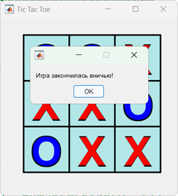

Feedforward network in Tic Tac Toe game MATLAB.

Dataset creates on played games where one player plays randomly and second player use my custom method for choosing best moves. 
So input data is a state of board before using "good" move algorithm and target is a result "good" move itself as one-hot encoding.

Network architecture: 9 input neurons, 27 hidden neurons, 9 output neurons with functions tansig, tansig, softmax.

Try to beat it:

